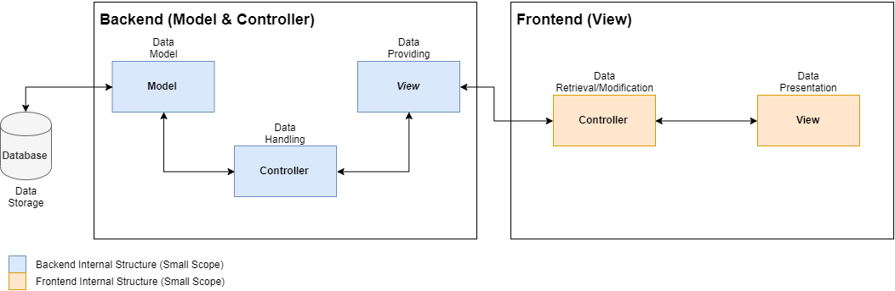
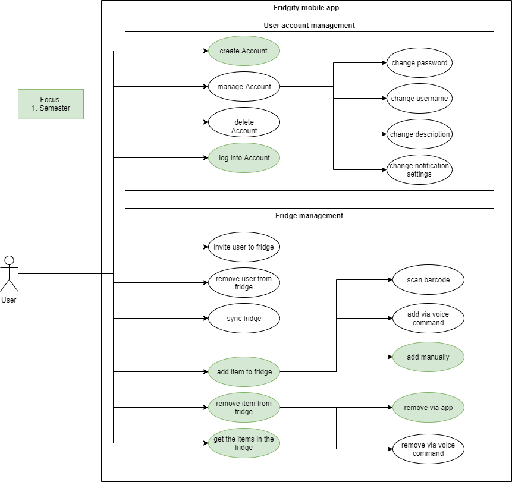

## The Cool Company 
## **Fridgify**  Software Architecture Document  Version 1.1

| **Date** | **Version** | **Description** | **Author** |
| -------- | ----------- | --------------- | ---------- |
| - | - | - | -|
| - | - | - | -|

## Table of Contents
1. [Introduction](#introduction)
    1. [Purpose](#purpose)
    2. [Scope](#scope)
    3. [Definitions, Acronyms and Abbreviations](#definitions-acronyms-and-abbreviations)
    4. [References](#references)
    5. [Overview](#overview)
2. [Architectural Representation](#architectural-representation)
3. [Architectural Goals and Constraints](#architectural-goals-and-constraints)
4. [Use-Case View](#use-case-view)
    1. [Use-Case Realizations](#use-case-realizations)
5. [Logical View](#logical-view)
    1. [Overview](#overview)
    2. [Architecturally Significant Design Packages](#architecturally-significant-design-packages)
6. [Process View](#process-view)
7. [Deployment View](#deployment-view)
8. [Implementation View](#implementation-view)
    1. [Overview](#overview)
    2. [Layers](#layers)
9. [Data View](#data-view)
10. [Size and Performance](#size-and-performance)
11. [Quality](#quality)

## 1 Introduction
### 1.1 Purpose
This document provides a comprehensive architectural overview of the system, using a number of different architectural views to depict different aspects of the system. It is intended to capture and convey the significant architectural decisions which have been made on the system.

### 1.2 Scope
This document describes the technical architecture of the **Fridgify** project, including the structure of classes, modules, dependencies and server/client.

### 1.3 Definitions, Acronyms and Abbreviations
| **Term** | **Definition** |
| -------- | -------------- |
| Device | Device, which allows users to keep track of their fridge contents (e.g. mobile phone, Raspberry Pi)
| REST | **RE**presentational **S**tate **T**ransfer is an architectural style for distributed hypermedia systems \[1\]
| API | Application Programming Interface connects *client* and *server*. \[2\] |
| Application Store |  A mobile application store, where users can get the application (e.g. App Store, Play Store)
| OS | Operating System
| Android | Google's OS for mobile phones \[3\] |
| iOS | Apple's OS for mobile phones \[4\] |
| UC | Use Case |
| VCS | Version Control System |
| n/a | not applicable |

### 1.4 References
\[1\] "What is REST", <https://restfulapi.net/>\
\[2\] Braunstein, Mark L., „Health Informatics on FHIR: How HL7's New
API is Transforming Healthcare". Springer, 2018\
\[3\] "About the platform", <https://developer.android.com/about>\
\[4\] "iOS 13 -- Apple Developer", <https://developer.apple.com/ios/>

### 1.5 Overview
This document contains the Architectural Representation, Goals and Constraints as well as the Logical, Deployment, Implementation and Data Views.

## 2 Architectural Representation

## 3 Architectural Goals and Constraints
In the backend we decided to use Django. Django allows us to utilize MVC in an easy and comprehendible way. Database tables are mapped to models, which are controlled by controllers, called handlers in our case, and are presented as HTTP and JSON responses.\
Our frontend is developed in Flutter, which allows an easy way to distribute our software to different platforms.\
Backend and frontend are being developed seperately, allowing them to live in a *separate eco-system* and being independent from one another.

## 4 Use-Case View

### 4.1 Use-Case Realizations
* [Use Case - Register](https://github.com/DonkeyCo/Fridgify/blob/documentation/documentation/uc/authentication/register.md)
* [Use Case - Login](https://github.com/DonkeyCo/Fridgify/blob/documentation/documentation/uc/authentication/login.md)
* [Use Case - Get Fridges](https://github.com/DonkeyCo/Fridgify/blob/documentation/documentation/uc/getFridges/getFridgesUseCase.md)
* [Use Case - Create Fridge](https://github.com/DonkeyCo/Fridgify/blob/documentation/documentation/uc/createFridge/createFridgeUseCase.md)
* [Use Case - Remove Fridge](https://github.com/DonkeyCo/Fridgify/blob/documentation/documentation/uc/removeFridge/deleteFridgeUseCase.md)
* [Use Case - Join Fridge](https://github.com/DonkeyCo/Fridgify/blob/documentation/documentation/uc/joinFridge/joinFridgeUseCase.md)
* [Use Case - Add Fridge Content](https://github.com/DonkeyCo/Fridgify/blob/documentation/documentation/uc/fridgeContent/addContent/addContentUseCase.md)
* [Use Case - Remove Fridge Content](https://github.com/DonkeyCo/Fridgify/blob/documentation/documentation/uc/fridgeContent/removeContent/removeContentUseCase.md)
* [Use Case - Get Fridge Content](https://github.com/DonkeyCo/Fridgify/blob/documentation/documentation/uc/fridgeContent/getContent/getFridgeContentUseCase.md)
* [Use Case - Change Content Volume](https://github.com/DonkeyCo/Fridgify/blob/documentation/documentation/uc/fridgeContent/changeContentVolume/changeContentVolume.md)

## 5 Logical View
**Frontend Logical View:**
