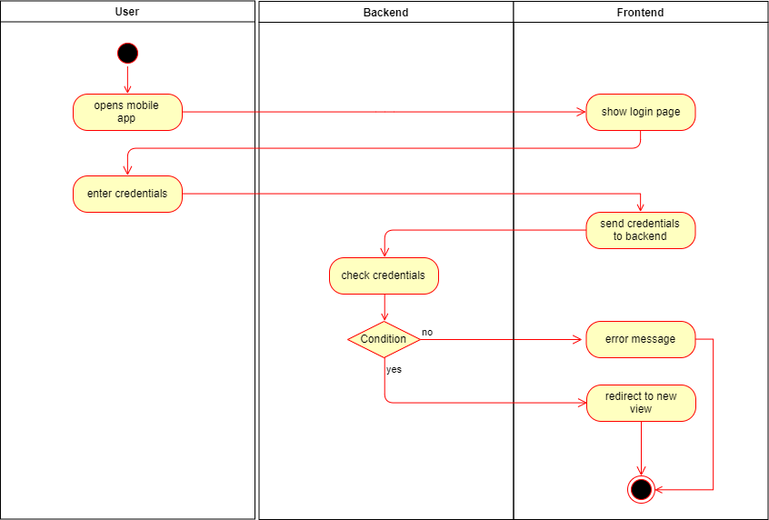

# Fridgify

## Use-Case Specification: Login

## 1. Login

### 1.1 Brief Description

Users should be able to login, if they already have an account.

## 2. Flow of Events

### 2.1 Basic Flow

The User opens the app and sees the login page. There he enters his credentials, consisting of his email and his password, if everything is correct, the user is authenticated and will be redirected to another view. A successful login results in a generation of a *login token*.

### 2.1.1 Activity Diagram



### 2.1.2 Mock Up

Screenshot if available

### 2.1.3 Feature File

```gherkin
Feature: Login Screen
  The User is on the login screen and logs in

  Scenario: The User logs in successful
    Given I see "login"
    And I enter a valid "email"
    And I enter a valid "password"
    When I tap the "login" button
    Then I see screen "overview"

  Scenario: The User logs in not successful
    Given I see "login"
    And I enter a dummy "email"
    And I enter a dummy "password"
    When I tap the "login" button
    Then I see popup "wrongData"

  Scenario: The User wants to create an account
    Given I see "login"
    When I tap the "register" label
    Then I see screen "register"

  Scenario: The User forgets his password
    Given I see "login"
    When I tap the "forgotPassword" label
    Then I see screen "forgotPassword"
```

## 3. Special Requirements

User needs to have an existing account with the entered email.

## 4. Preconditions

### 4.1 Internet Connection

Users require a internet connection to login.

## 5. Postconditions

### 5.1 Login Token

The frontend application caches the received token returned by the backend.

## 6. Extension Points

**n / a**