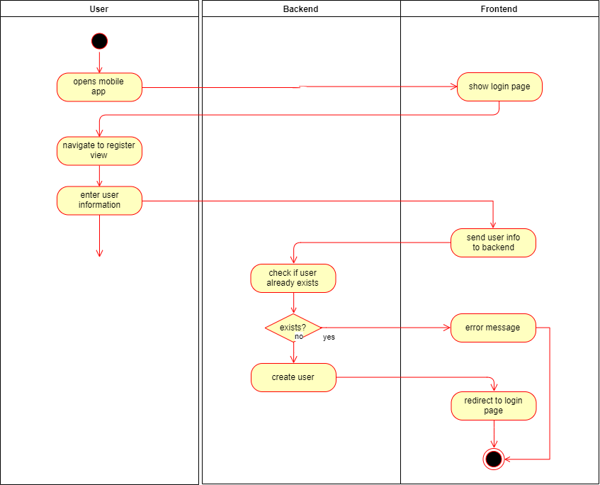

# Fridgify

## Use-Case Specification: Register

## 1. Register

### 1.1 Brief Description

To use Fridgify, every user needs an account. Therefore they have to register an account.

## 2. Flow of Events

### 2.1 Basic Flow

The user clicks on register. In the Register View he enters his user information, consisting of an email, username, password.

### 2.1.1 Activity Diagram



### 2.1.2 Mock Up

Screenshot if available

### 2.1.3 Feature File

```gherkin
Feature: Register Screen
  The user is on the register screen and signs up

  Scenario: The User registers successfully
    Given I see "register"
    And I enter valid "email"
    And I enter valid "password"
    And I enter valid "repeatPassword"
    When I tap the "register" button
    Then I see screen "overview"

  Scenario: The User enters used email
    Given I see "register"
    And I enter used "email"
    And I enter valid "password"
    And I enter valid "repeatPassword"
    When I tap the "register" button
    Then I see popup "mail exists"

  Scenario: The User enters wrong password
    Given I see "register"
    And I enter valid "email"
    And I enter valid "password"
    And I enter dummy "repeatPassword"
    When I tap the "register" button
    Then I see popup "password no match"

  Scenario: The User wants to login
    Given I see "register"
    When I tap the "login" label
    Then I see screen "login"
```

## 3. Special Requirements

n/a

## 4. Preconditions

### 4.1 Internet Connection

The user needs a internet connection to create an account.

## 5. Postconditions

n/a

## 6. Extension Points

**n / a**