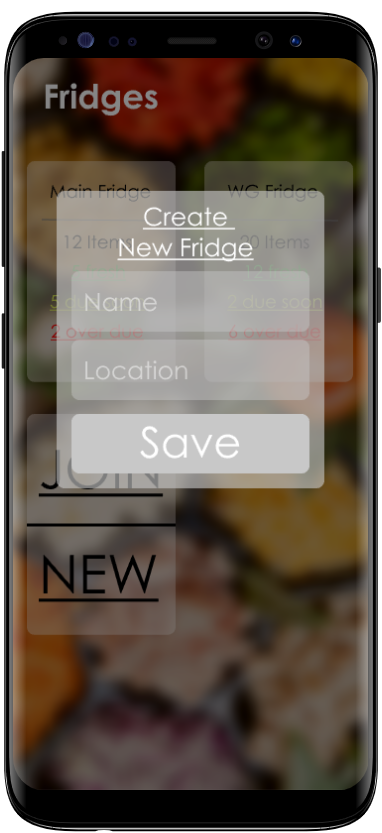

# Fridgify

## Use-Case Specification: Join Fridge

## 1. Join Fridge

### 1.1 Brief Description

Fridgify offers to give a overview over the items in a fridge. It is therefore possible to create a fridge.

## 2. Flow of Events

### 2.1 Basic Flow

The user needs to log into the app. When clicking on the add panel a popup is displayed that offers the option to join or create a fridge. The user has to click on create fridge. A popup is displayed that requests a name, location and color of the new fridge. The user is redirected to the main page when the user confirms to create a new fridge. A new panel for the new fridge is then displayed. THe new fridge is then added to the account of the user.  

### 2.1.1 Activity Diagram

### 2.1.2 Mock Up

) \
Fridges Overview \

## 3. Special Requirements

### 3.1. Owning an account

In order to create a new fridge the user has to have an account. Only if he has one he will be able to create a new fridge.

## 4. Preconditions

### 4.1 The user downloaded the app 

The user has to have already downloaded the app.

## 5. Postconditions

### 5.1 The user created a new fridge

The user sees the fridge on the main page and can add items to the fridge.

## 6. Extension Points

**n / a**