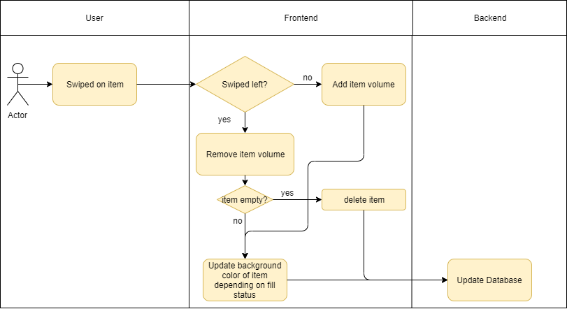

# Fridgify

## Use-Case Specification: Change Fridge Content Volume

## 1. Change Fridge Content Volume

### 1.1 Brief Description

An User can easily change the content of an item eg. Milk: 1000ml -> Milk: 500ml by swiping from right to left on the item. Or fill it up again by swiping in the other direction.

## 2. Flow of Events

### 2.1 Basic Flow

After the user swipes left or right on an item in the fridge overview the current volume gets changed. If an item reaches a volume of 0 it gets removed.

#### 2.1.1 Activity Diagram

#### 2.1.2 Mock Up

Screenshot if available

### 2.2 Alternativ Flow

n/a

#### 2.2.1 Activity Diagram

n/a

#### 2.2.2 Mock Up

n/a

## 3. Special Requirements

n/a

## 4. Preconditions

### 4.1 Authentication

The user has to be logged into the system. He has to be authenticated to be able to communicate with the backend, otherwise getting content is not possible.

### 4.2 Access Rights

The user has to have access rights to the chosen fridge. Otherwise the backend is not able to retrieve the required data and this use case is not fulfillable.

### 4.3 Internet Connection

The user has to have a stable internet connection. If in any case the user does not have an internet connection, communication with the backend will certainly fail.

## 5. Postconditions

n/a

## 6. Extension Points

n/a