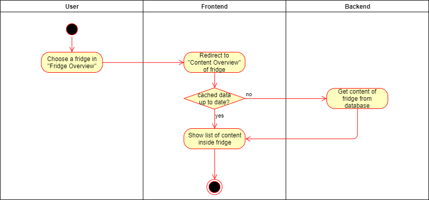
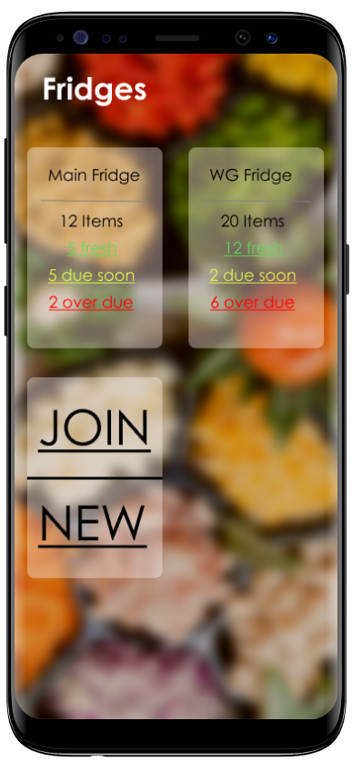
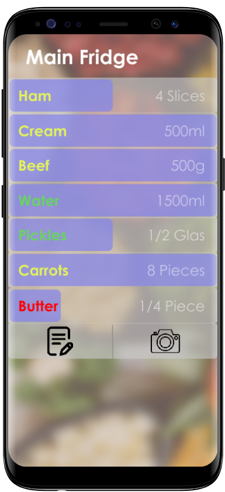

# Fridgify

## Use-Case Specification: Get Fridge Content

## 1. Get Fridge Content

### 1.1 Brief Description

Every user can view a fridge's content, which he is a member or admin of. Users can gain an overview of a fridge via a listing of all available items.

## 2. Flow of Events

### 2.1 Basic Flow

After choosing a fridge in the 'fridge overview', the user is redirected to a view containing a list of each individual item inside the fridge. Same items are grouped together to maintain order.

#### 2.1.1 Activity Diagram



#### 2.1.2 Mock Up

 \
Fridges Overview \
\
 \
Content Overview


#### 2.1.3 Feature File

```gherkin
Feature: Content Screen
    The User is on the fridge content screen

    Scenario: See the content
        Given I see screen "fridge"
        Then I have 5 items

    Scenario: See content info
        Given I see screen "fridge"
        When I tap the "milk" label
        Then I see popup "milkInfo"
```


## 3. Special Requirements

n/a

## 4. Preconditions

### 4.1 Authentication

The user has to be logged into the system. He has to be authenticated to be able to communicate with the backend, otherwise getting content is not possible.

### 4.2 Access Rights

The user has to have access rights to the chosen fridge. Otherwise the backend is not able to retrieve the required data and this use case is not fulfillable.

### 4.3 Internet Connection

The user has to have a stable internet connection. If in any case the user does not have an internet connection, communication with the backend will certainly fail.

## 5. Postconditions

n/a

## 6. Extension Points

n/a
