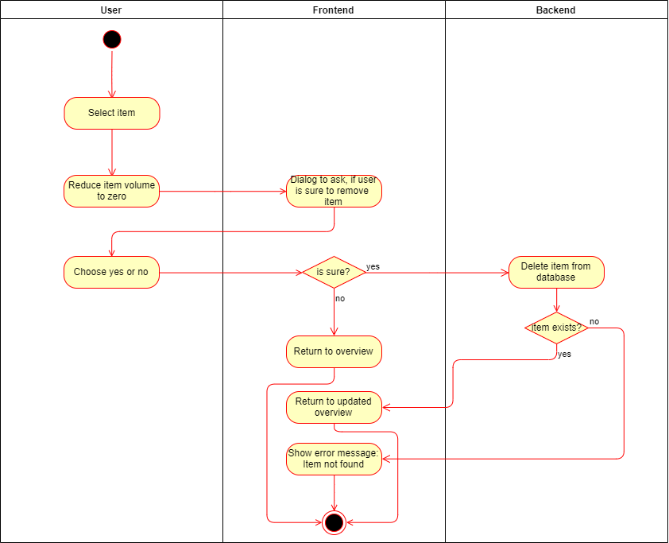

# Fridgify

## Use-Case Specification: Remove Fridge Content

## 1. Remove Fridge Content

### 1.1 Brief Description

Every user is able to manage his own fridge. Managing a fridge and its content requires him to be able to delete/remove items easily. Each user has the ability to remove each item individually from the "Fridge Content Overview".

## 2. Flow of Events

### 2.1 Basic Flow

In the "Fridge Content Overview" an user is able remove specific items. To do so he has to set the content's volume to zero, implying that it is empty. Every empty item is automatically deleted, after securing, that there was an actual intent to delete said item. After successfully deleting the item, the user is redirected to an updated version of the "Fridge Content Overview".

### 2.1.1 Activity Diagram

### 2.1.2 Mock Up

Screenshot if available

### 2.2 Alternativ Flow

n/a

### 2.2.1 Activity Diagram

n/a

### 2.2.2 Mock Up

n/a

## 3. Special Requirements

n/a

## 4. Preconditions

### 4.1 Authentication

The user has to be logged into the system. He has to be authenticated to be able to communicate with the backend, otherwise getting content is not possible.

### 4.2 Access Rights

The user has to have access rights to the chosen fridge. Otherwise the backend is not able to retrieve the required data and this use case is not fulfillable.

### 4.3 Internet Connection

The user has to have a stable internet connection. If in any case the user does not have an internet connection, communication with the backend will certainly fail.

## 5. Postconditions

### 5.1 Returning

After deleting an item, whether successfully or unsuccessfully, the user should be redirected to the "Fridge Content Overview". 

### 5.2 Cache

After deleting an item successfully the current overview of items should be cached and the old one deleted.

## 6. Extension Points

n/a